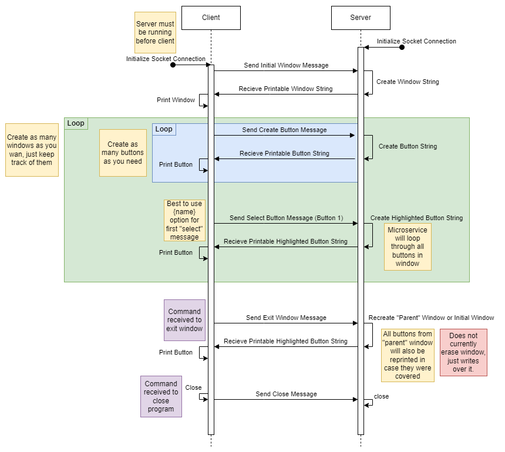

# Basic_TUI
This is a basic terminal-based ui engine made with python.

# GUIDELINES
- HOST and PORT must be the same on both sides
- Server will always respond with `<data>;;<printable>`
- A window must be created in order to create buttons
- client messages will have parameters separated by a semicolon (`;`)

# Create Window Message (W)
## Creation Elements
| Name | Description | Syntax |
|---|---|---|
| X-Position | X-Position of the top-left corner of the window | `<num>x` |
| Y-Position | Y-Position of the top-left corner of the window | `<num>y` |
| Prompt | A `\n` separated string of text lines | `{<str>}` |
| Window Width | How many characters wide the window is | `<num>W` |
| Window Height | How many characters tall the window is | `<num>H` |
| Textbox Width* | How many characters wide the prompt's textbox is | `<num>w` |
| Textbox Height* | How many characters tall the prompt's textbox is | `<num>h` |
| Vertical Align | Where on the y-axis the prompt should be placed (top, center, bottom) | `[T\|C\|B]` |
| Horizontal Align | Where on the x-axis the prompt should be placed (left, middle, right) | `[L\|M\|R]` |
| Prompt Text Color | The color of the prompt's text | `[K\|R\|G\|Y\|B\|M\|C\|W]f` |
| Window Background Color | The background color for the window | `[K\|R\|G\|Y\|B\|M\|C\|W]f` |
| Highlight Text Color | The color of the text when highlighted | `[K\|R\|G\|Y\|B\|M\|C\|W]s` |
| Highlight Background Color | The color of the background when text is highlighted | `[K\|R\|G\|Y\|B\|M\|C\|W]S` |
| Parent Window | The index of the window to revert to when this one exits (-1 if first window)| `<num>p` |
### Example Window Creation Message
- `b"W;-1p;1x;2y;Kf;Wb;{Hello World\nThis is a prompt};T;M;30W;10H;15w;2h;RS;Cs"`

(*) **Textbox width and height are soon to be deprecated**

# Create Button Message (B)
## Creation Elements
| Name | Description | Syntax |
|---|---|---|
| X-Position | X-Position of the first text character | `<num>x` |
| Y-Position | Y-Position of the first text character | `<num>y` |
| Text | Text to be put on the button | `{<str>}` |
| Padding | How many blocks of padding will surround text | `<num>p` |
| Foreground | The color of the text | `[K\|R\|G\|Y\|B\|M\|C\|W]f`* |
| Background | The background color for the text (padding included) | `[K\|R\|G\|Y\|B\|M\|C\|W]b`* |
### Example Button Creation Message
- `b"B;1p;4x;24y;Wf;Bb;{Hello World}"`

# Select Button Message (S)
## Creation Elements
| Name | Description | Syntax |
|---|---|---|
| Text | Text of the button to go to | `{<str>}` |
| Search X-Axis | Search to the right or left for nearest button (+x is right) | `[+\|-]x`* |
| Search Y-Axis | Search down or up for the nearest button (+y is down) | `[+\|-]y`* |
### Example Button Selection Messages
- `b"S;{Hello World}"`
- `b"S;-y"`

(**) ***Note that you can only use one method of selection***

# Exit Window Message (E)
## Creation Elements
| Name | Description | Syntax |
|---|---|---|
| Window Index | Index returned by the Window Creation Message of the window you wish to exit | `<num>` |
### Example Window Exitting Messages
- `b"E;0"`

# UML

